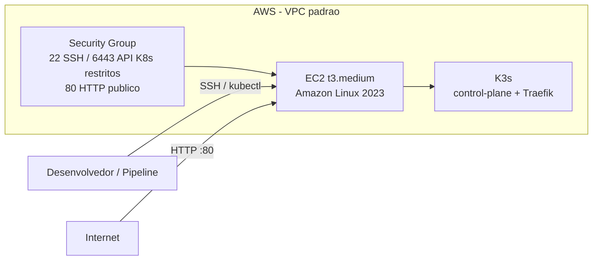

# Infraestrutura Kubernetes — Oficina FIAP (Fase 3)

## Descrição

Este repositório provisiona, via Terraform, o cluster Kubernetes (K3s) que executa a aplicação principal do Tech Challenge Fase 3. O cluster roda em uma única instância EC2 na AWS, com o K3s instalado automaticamente no boot da máquina.

## Tecnologias utilizadas

- Terraform (>= 1.5)
- AWS EC2 (Amazon Linux 2023)
- K3s (Kubernetes leve, nó único)
- GitHub Actions (CI/CD)
- Backend remoto S3 para o state do Terraform

## Arquitetura



A justificativa completa da escolha (K3s em uma EC2, em vez de EKS ou Kubernetes local) está no [ADR-001](https://github.com/pisanohub/oficina_fiap/blob/main/documentacao/decisoes/ADR-001-k3s-em-ec2.md), no repositório `oficina_fiap`.

## Passos para execução e deploy

### Pré-requisitos

- Conta AWS Academy Learner Lab ativa
- Terraform >= 1.5
- Par de chaves SSH gerado (`ssh-keygen`)

### Execução local

```bash
terraform init
terraform plan
terraform apply
```

Variáveis necessárias (via `-var` ou `TF_VAR_*`):

- `ssh_allowed_cidr`: CIDR autorizado para acesso SSH e à API do Kubernetes
- `ssh_public_key`: conteúdo da chave pública SSH

### CI/CD

O pipeline (`.github/workflows/terraform.yml`) roda automaticamente:

- `terraform plan` em todo push/PR para a `main`
- `terraform apply` automático após merge na `main`
- Pode também ser disparado manualmente via `workflow_dispatch`

A branch `main` é protegida: exige Pull Request e o check `terraform` com sucesso antes de qualquer merge.

### Obtendo acesso ao cluster após o apply

```bash
terraform output ssh_command
terraform output kubeconfig_fetch_command
```

Como a instância é recriada a cada sessão do AWS Academy, o IP público muda a cada sessão — é necessário buscar um kubeconfig novo sempre que o cluster for recriado.

## Observações

- O cluster é efêmero: a instância é recriada a cada sessão de trabalho, já que o AWS Academy encerra recursos EC2 automaticamente ao final da sessão de laboratório.
- O Security Group libera a porta 80 publicamente para expor a aplicação via Ingress (Traefik, incluso no K3s).
